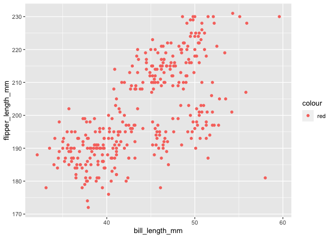

p8105\_hw1\_xw2757
================

``` r
library(tidyverse)
```

    ## ── Attaching packages ─────────────────────────────────────── tidyverse 1.3.1 ──

    ## ✓ ggplot2 3.3.5     ✓ purrr   0.3.4
    ## ✓ tibble  3.1.4     ✓ dplyr   1.0.7
    ## ✓ tidyr   1.1.3     ✓ stringr 1.4.0
    ## ✓ readr   2.0.1     ✓ forcats 0.5.1

    ## ── Conflicts ────────────────────────────────────────── tidyverse_conflicts() ──
    ## x dplyr::filter() masks stats::filter()
    ## x dplyr::lag()    masks stats::lag()

\#\#Problem 1

***Create a data frame comprised of:*** ***a random sample of size 10
from a standard Normal distribution*** ***a logical vector indicating
whether elements of the sample are greater than 0*** ***a character
vector of length 10*** ***a factor vector of length 10, with 3 different
factor “levels”***

``` r
p1_df <- tibble(
  random_samp = rnorm(10),
  random_samp_pos = random_samp > 0,
  char_vec = c("This course", "is being offered", "in the Fall", "of 2021", "through the", "Biostatistics", "Department" , "at the",  "Columbia School", "of Public Health"),
  factor_vec = factor(c("dead", "alive", "zombie","dead","alive", "zombie","zombie", "zombie", "dead", "alive"))
)

view(p1_df)
```

***Try to take the mean of each variable in your dataframe. What works
and what doesn’t?***

``` r
mean(pull(p1_df, random_samp))
```

    ## [1] -0.5534683

``` r
mean(pull(p1_df, random_samp_pos))
```

    ## [1] 0.4

``` r
mean(pull(p1_df, char_vec))
```

    ## Warning in mean.default(pull(p1_df, char_vec)): argument is not numeric or
    ## logical: returning NA

    ## [1] NA

``` r
mean(pull(p1_df, factor_vec))
```

    ## Warning in mean.default(pull(p1_df, factor_vec)): argument is not numeric or
    ## logical: returning NA

    ## [1] NA

mean of numeric vector and logical vector worked, but did not work for
character and factor vectors.

***In some cases, you can explicitly convert variables from one type to
another. Write a code chunk that applies the as.numeric function to the
logical, character, and factor variables (please show this chunk but not
the output). What happens, and why? Does this help explain what happens
when you try to take the mean?***

``` r
as.numeric(random_samp_pos)
as.numeric(factor_vec)
as.numeric(char_vec)
```

I can only convert the factor variable to numeric form. When I try to
take the mean, factor variable and character variable would not compute
because they are not numeric or logical.

\#\#Problem 2

**Use the code below to download the a package containing the penguins
dataset:**

``` r
install.packages("palmerpenguins")
```

**Next, use the following code (in your RMarkdown file) to load the
penguins dataset:**

``` r
data("penguins", package = "palmerpenguins")
```

**Write a short description of the penguins dataset (not the
penguins\_raw dataset) using inline R code, including:** **the data in
this dataset, including names / values of important variables** **the
size of the dataset (using nrow and ncol)** **the mean flipper length**

The size of the **penguins** dataset is 344 x 8, with 8 variables and
344 observations.

Variables described in this dataset are as followed: species, island,
bill\_length\_mm, bill\_depth\_mm, flipper\_length\_mm, body\_mass\_g,
sex, year.

The mean of the sample’s flipper length, given available data, is
200.9152047.

**Make a scatterplot of flipper\_length\_mm (y) vs bill\_length\_mm (x);
color points using the species variable (adding color = … inside of aes
in your ggplot code should help).** **Export your first scatterplot to
your project directory using ggsave.**

``` r
ggplot(penguins, aes(x = bill_length_mm, y = flipper_length_mm, color = "red")) + geom_point()
```

    ## Warning: Removed 2 rows containing missing values (geom_point).

<!-- -->

``` r
ggsave("flipper_length_X_bill_length_Scatter.pdf", height=6, width= 6)
```

    ## Warning: Removed 2 rows containing missing values (geom_point).
